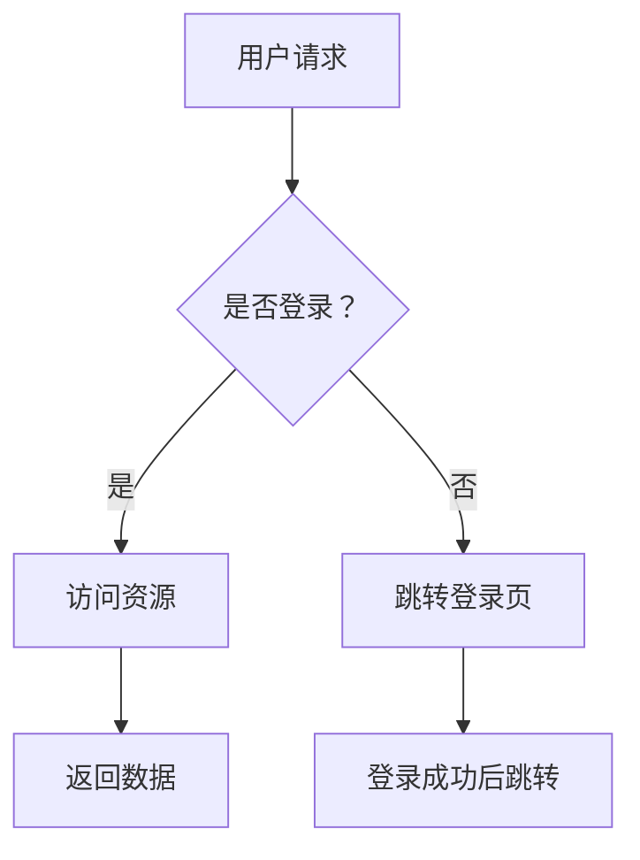

# 技术图绘制方法与工具调研报告

**调研时间**：2026 年 4 月 27 日
**调研范围**：技术文档中各类图表的绘制原则、工具选型与实践方法

---

## 一、引言：为什么技术图如此重要

在技术文档、架构说明和知识分享中，一幅好的技术图往往比千言万语更高效。但"好"的标准是什么？不是美观，不是精细，而是**准确传达意图、降低理解成本、让读者一眼抓住重点**。

好的技术图遵循"图表即论点"原则：每幅图都应该有明确的表达目的，而非装饰。

---

## 二、技术图的分类与选用

### 2.1 常见图类型及适用场景

| 图类型 | 核心用途 | 典型场景 |
|--------|---------|---------|
| **流程图 (Flowchart)** | 展示过程/决策分支 | API 调用流程、用户操作步骤 |
| **架构图 (Architecture Diagram)** | 展示系统组件与关系 | 微服务架构、基础设施拓扑 |
| **时序图 (Sequence Diagram)** | 展示对象间消息交互 | 服务间调用顺序、多步骤协作 |
| **ER 图 (Entity-Relationship)** | 展示数据模型结构 | 数据库设计、实体关系建模 |
| **用例图 (Use Case Diagram)** | 展示系统功能边界 | 需求分析、功能清单 |
| **组件图 (Component Diagram)** | 展示模块划分与接口 | 模块解耦、接口定义 |
| **部署图 (Deployment Diagram)** | 展示软硬件物理部署 | 基础设施、运行环境 |
| **状态图 (State Diagram)** | 展示状态转换逻辑 | 订单状态、任务生命周期 |
| **概念图 (Concept Map)** | 展示知识点关联 | 知识整理、技术决策背景 |

### 2.2 选型决策树

```
是否需要展示"怎么做"（流程）？
  ├─ 是 → 是否有明确的角色/对象交互？ → 是 → 时序图
  │                                    └─ 否 → 流程图
  └─ 否 → 是否需要展示"由什么组成"（结构）？
              ├─ 是 → 数据为核心？ → 是 → ER 图
              │                   └─ 否 → 组件图 / 架构图
              └─ 否 → 是否需要展示"部署在哪里"？ → 部署图
```

---

## 三、构图原则：让图表说话

### 3.1 布局（Layout）

**核心原则：从上到下或从左到右，顺着阅读惯性。**

- **层级清晰**：最重要的主体放在左上角或顶部，细节从左上向右下延伸
- **对齐整齐**：同类元素左对齐或居中对齐，留白均匀，避免元素堆叠
- **流向一致**：信息流方向保持统一（通常从左到右或从上到下），用箭头明示流向
- **留白呼吸**：元素间距至少 20-30px，避免拥挤，但也不要有大块空白
- **分块清晰**：用背景色块划分区域（层/模块），色块透明度用 30-35%

### 3.2 视觉层次（Visual Hierarchy）

**读者的眼睛会按以下顺序扫视：颜色 > 形状 > 位置 > 大小**

- **用颜色区分类型**：同一类元素用相同的填充色（如数据库用浅绿色，外部服务用浅橙色）
- **用形状区分语义**：
  - 矩形 = 过程/服务/容器
  - 椭圆/圆角矩形 = 开始/结束
  - 菱形 = 判断/决策节点
  - 平行四边形 = 输入/输出
  - 圆柱形 = 数据库
- **用连线样式区分关系**：
  - 实线箭头 = 同步调用/数据流
  - 虚线箭头 = 异步消息/回调
  - 无箭头连线 = 关联关系
  - 双向箭头 = 双向通信

### 3.3 颜色理论（Color Theory）

**技术图中颜色不是装饰，是语义编码。**

#### 语义色板（Excalidraw 推荐配色）

| 语义 | 填充色 | 描边色 |
|------|--------|--------|
| 输入/来源/用户 | `#a5d8ff` 浅蓝 | `#4a9eed` 蓝 |
| 输出/成功/完成 | `#b2f2bb` 浅绿 | `#22c55e` 绿 |
| 外部/第三方 | `#ffd8a8` 浅橙 | `#f59e0b` 橙 |
| 处理/中间状态 | `#d0bfff` 浅紫 | `#8b5cf6` 紫 |
| 错误/告警/危险 | `#ffc9c9` 浅红 | `#ef4444` 红 |
| 存储/数据/持久化 | `#c3fae8` 浅青 | `#20c997` 青 |
| 决策/判断 | `#fff3bf` 浅黄 | `#f59e0b` 黄 |
| 分析/指标 | `#eebefa` 浅粉 | `#ec4899` 粉 |

#### 分层背景色（透明度 30-35%）

| 层级 | 背景色 |
|------|--------|
| 前端 / UI 层 | `#dbe4ff` 浅蓝 |
| 逻辑层 / Agent 层 | `#e5dbff` 浅紫 |
| 数据层 / 工具层 | `#d3f9d8` 浅绿 |

#### 配色禁忌

- ❌ 浅灰色文字（`#b0b0b0`）在白色背景上不可读
- ❌ 避免同时使用超过 5 种颜色，防止眼花缭乱
- ❌ 不要用纯黑描边（`#000000`），用深灰（`#1e1e1e`）更柔和自然
- ❌ 避免互补色（红配绿）并置，除非表示对比

### 3.4 文字与标注

**可读性是技术图的底线。**

- **字体字号**：
  - 正文/标签：最小 `fontSize: 16px`
  - 标题：最小 `fontSize: 20px`
  - 辅助说明：最大 `fontSize: 14px`（仅在空间充足时使用）
- **文字颜色**：默认使用 `#1e1e1e`（深灰），次要注释用 `#757575`
- **标签命名**：
  - 使用名词短语：`User Service` 而非 `Users`
  - 使用行业通用术语：`API Gateway` 而非 `接口网关`
  - 保持长度一致：避免过长的标签，必要时换行
- **避免全大写**：除非是公认缩写（API、HTTP、DB）
- **不要用 emoji**：技术图中 emoji 渲染不稳定，且破坏专业感

### 3.5 连线与箭头

- **箭头指明方向**：如果有明确的数据流向，必须用箭头
- **标注关键信息**：在连线上方/下方加标注（如 `POST /users`、`JWT Token`）
- **曲直结合**：
  - 90 度折线（工整）= 结构/拓扑关系
  - 斜线/曲线 = 灵活的数据流
- **线条粗细**：主要流程用粗线（2px），次要流程用细线（1px）

---

## 四、工具选型

### 4.1 工具全景图

| 工具 | 类型 | 上手难度 | 渲染质量 | 适用场景 | 推荐度 |
|------|------|---------|---------|---------|--------|
| **Excalidraw** | 手绘风格矢量图 | ⭐ 低 | ⭐⭐⭐⭐⭐ | 架构图、流程图、演示 | ⭐⭐⭐⭐⭐ |
| **Mermaid** | 代码渲染图 | ⭐⭐ 低 | ⭐⭐⭐ | Markdown 文档内嵌图 | ⭐⭐⭐⭐ |
| **PlantUML** | 代码渲染图 | ⭐⭐ 中 | ⭐⭐⭐ | UML 图、复杂关系图 | ⭐⭐⭐ |
| **draw.io (diagrams.net)** | 模板绘图 | ⭐⭐ 低 | ⭐⭐⭐⭐ | 流程图、架构图、企业图 | ⭐⭐⭐⭐ |
| **Graphviz** | 代码渲染图 | ⭐⭐⭐ 中 | ⭐⭐⭐ | 自动布局的关系图 | ⭐⭐⭐ |
| **Visio** | 商业绘图 | ⭐⭐⭐ 高 | ⭐⭐⭐⭐⭐ | 企业级流程图、泳道图 | ⭐⭐⭐ |
| **D2 (Distuark)** | 代码渲染图 | ⭐⭐ 中 | ⭐⭐⭐⭐ | 声明式架构图、现代工具链 | ⭐⭐⭐⭐ |
| **tldraw** | 无限画布协作 | ⭐ 低 | ⭐⭐⭐⭐ | 团队协作绘图 | ⭐⭐⭐ |

### 4.2 工具对比与选型建议

#### Excalidraw — 最佳通用技术图工具

**优点：**
- 手绘风格传达"草图感"，让技术图更有表达力，适合架构图和流程图
- 纯 JSON 文件格式，易于版本控制（Git 友好）
- 完全免费，无需账号
- 支持导出 SVG、PNG、PDF

**缺点：**
- 不擅长精确的电路图、管道图等工程制图
- 多人协作需要 Excalidraw+ 订阅

**适用场景：** 架构图、系统设计图、流程图、演示文稿配图

#### Mermaid — Markdown 文档的最佳拍档

**优点：**
- 在 Markdown 中用代码描述图，天然嵌入文档
- 支持流程图、时序图、ER 图、甘特图、类图等
- GitHub、GitLab、Notion、Obsidian 等主流平台原生支持

**缺点：**
- 样式定制能力弱（颜色、字体受限）
- 复杂图容易产生渲染混乱
- 布局自动生成，不够精细

**适用场景：** 技术博客、API 文档、README、需求文档

**示例（Mermaid 流程图）：**


#### draw.io — 企业级绘图首选

**优点：**
- 模板丰富（AWS、Azure、GCP 架构模板一键套用）
- 支持本地离线使用（Desktop 版）
- 直接导出为 PNG、SVG、PDF、XML
- 完全免费，无需账号

**缺点：**
- 文件格式为 XML（可读但不够 Git 友好）
- 界面较老旧，不如 Excalidraw 优雅

**适用场景：** 基础设施架构图、云服务拓扑图、泳道图

#### PlantUML — 复杂 UML 图专家

**优点：**
- 强大的 UML 建模能力（时序图、类图、用例图、状态图）
- 支持多种渲染后端（Graphviz、Ditaa、PlantUML Server）
- 与 Confluence、Jira 等企业工具深度集成

**缺点：**
- 语法复杂，学习曲线陡
- 渲染样式较为陈旧

**适用场景：** 软件设计文档、类图、详细设计文档

#### D2 — 现代架构图的新选择

**优点：**
- 声明式语法，比 PlantUML 更简洁现代
- 主题定制能力强，输出 SVG 质量高
- 支持 Markdown 嵌入

**缺点：**
- 生态尚在成熟中

**适用场景：** 云架构图、基础设施代码、SRE 文档

### 4.3 工具选型建议

| 文档类型 | 推荐工具 |
|---------|---------|
| 个人博客 / 技术笔记（Obsidian/Notion） | **Mermaid**（嵌入）或 **Excalidraw** |
| 团队架构文档 / 设计文档 | **draw.io** 或 **Excalidraw** |
| API 文档 / 接口说明 | **Mermaid 时序图** |
| 演示文稿（PPT/Keynote） | **Excalidraw**（矢量，导出 PNG/SVG） |
| 需要版本控制的图（Git） | **Excalidraw JSON** 或 **Mermaid** |
| 企业流程图 / 泳道图 | **draw.io** |
| 详细设计（UML 类图/时序图） | **PlantUML** 或 **draw.io** |

---

## 五、各类图的绘制规范

### 5.1 流程图（Flowchart）

**设计要点：**
- 从左上角开始，向右或向下展开
- 判断节点（菱形）后必须有两条以上分支
- 关键节点（开始/结束）用圆角矩形，与普通过程（矩形）区分
- 并行分支用虚线或同一背景色块包裹
- 子流程用虚线框包裹，并标注"子流程名称"

**常见错误：**
- 所有节点都是矩形，没有判断节点
- 线条交叉混乱，没有用弧线避免交叉
- 缺少开始和结束节点

### 5.2 架构图（Architecture Diagram）

**设计要点：**
- **分层原则**：按照数据流方向分层（从下到上：数据层 → 服务层 → 接口层 → 用户层）
- **组件命名**：使用 `名词` 或 `名词短语`：`Database`、`Auth Service`、`API Gateway`
- **边界划分**：用虚线框或背景色块表示同一子系统/域
- **外部依赖**：放在最外侧，用不同颜色（浅橙）标注
- **数据流向**：用箭头标注数据方向，不要有无指向的连接线

**分层示例：**
```
┌─────────────────────────────────────┐
│         用户层（User Layer）          │  ← 背景色：浅蓝
│   [Web App]    [Mobile App]         │
└──────────────────┬──────────────────┘
                   │
┌──────────────────▼──────────────────┐
│       接口层（API Layer）             │  ← 背景色：浅紫
│        [API Gateway]                 │
└──────────────────┬──────────────────┘
                   │
┌──────────────────▼──────────────────┐
│       服务层（Service Layer）          │  ← 背景色：浅紫
│  [Auth Service]  [User Service]      │
└──────────────────┬──────────────────┘
                   │
┌──────────────────▼──────────────────┐
│        数据层（Data Layer）            │  ← 背景色：浅绿
│     [PostgreSQL]   [Redis]           │
└─────────────────────────────────────┘
```

### 5.3 时序图（Sequence Diagram）

**设计要点：**
- **角色/对象列**：在顶部用矩形标注，横跨整图
- **生命线**：用虚线从角色列向下延伸，表示时间流逝
- **消息箭头**：
  - 实线箭头 = 同步调用
  - 虚线箭头 = 返回
  - 斜箭头（↘）= 异步消息
- **激活条**：在生命线上用短粗线表示对象处理时间
- **自调用**：带折叠箭头的垂直自调用表示递归/循环
- **注释**：右侧空白处用虚线连接的文本框标注

**常见错误：**
- 所有消息都用实线箭头，没有区分同步/异步/返回
- 缺少返回消息，读者无法确认响应关系
- 消息标签不完整（缺少方法名和参数）

### 5.4 ER 图（Entity-Relationship）

**设计要点：**
- **实体**：用矩形表示，名称在顶部
- **属性**：用椭圆或圆角矩形表示，主键加下划线
- **关系**：用菱形表示，标注关系类型（1:1、1:N、N:M）
- **连线**：标注外键引用方向
- **布局**：核心实体放中间，外围实体按关系紧邻摆放

### 5.5 概念图（Concept Map）

**设计要点：**
- **中心概念**放中间，用大字体/醒目颜色
- **相关概念**围绕中心，向外辐射
- **连接词**写在连线旁（是/属于/包含/导致/需要）
- **层级分明**：抽象概念在上，具体实例在下
- **避免过长连线**：用布局调整代替绕远线的连接

---

## 六、Excalidraw 专项规范

### 6.1 文件格式

Excalidraw 使用 `.excalidraw` JSON 格式，核心结构：

```json
{
  "type": "excalidraw",
  "version": 2,
  "source": "hermes-agent",
  "elements": [ ... ],
  "appState": {
    "viewBackgroundColor": "#ffffff"
  }
}
```

### 6.2 元素绑定规范（关键！）

Excalidraw 的文本标签**必须**通过容器绑定实现，否则标签不会显示：

**绑定步骤（缺一不可）：**
1. 形状的 `boundElements` 数组中包含 `{"id": "t_xxx", "type": "text"}`
2. 文本元素的 `containerId` 指向该形状的 `id`
3. 文本元素的 `fontFamily: 1`（手绘字体）
4. 文本元素的 `originalText` 与 `text` 一致
5. 文本元素设置 `autoResize: true`

**错误写法（标签不显示）：**
```json
{ "type": "rectangle", "label": "My Box" }  // ❌ "label" 不是 Excalidraw 有效属性
```

**正确写法：**
```json
[
  { "type": "rectangle", "id": "r1", "x": 100, "y": 100, "width": 200, "height": 80,
    "backgroundColor": "#a5d8ff", "fillStyle": "solid",
    "boundElements": [{ "id": "t_r1", "type": "text" }, { "id": "a1", "type": "arrow" }] },
  { "type": "text", "id": "t_r1", "x": 105, "y": 125, "width": 190, "height": 25,
    "text": "My Box", "fontSize": 20, "fontFamily": 1, "strokeColor": "#1e1e1e",
    "textAlign": "center", "verticalAlign": "middle",
    "containerId": "r1", "originalText": "My Box", "autoResize": true }
]
```

### 6.3 箭头绑定

箭头连接到形状时使用 `startBinding` 和 `endBinding`：

```json
{
  "type": "arrow", "id": "a1",
  "x": 300, "y": 150, "width": 150, "height": 0,
  "points": [[0,0], [150,0]], "endArrowhead": "arrow",
  "startBinding": { "elementId": "r1", "fixedPoint": [1, 0.5] },
  "endBinding": { "elementId": "r2", "fixedPoint": [0, 0.5] }
}
```

`fixedPoint` 取值：`top=[0.5,0]`、`bottom=[0.5,1]`、`left=[0,0.5]`、`right=[1,0.5]`

### 6.4 绘制顺序（z-order）

**原则：背景先画，元素按从后到前的顺序排列。**

良好实践：
```
背景色块 → 形状1 → 形状1的标签 → 形状1的箭头 → 形状2 → 形状2的标签 → 形状2的箭头 → 装饰元素
```

禁止做法：把所有矩形放一起 → 所有文本放一起 → 所有箭头放一起（导致覆盖问题）

### 6.5 字号与尺寸底线

| 元素 | 最小值 |
|------|--------|
| 正文/标签字号 | `fontSize: 16` |
| 标题字号 | `fontSize: 20` |
| 最小字号（辅助注释） | `fontSize: 14` |
| 形状最小尺寸（带标签） | `width: 120`, `height: 60` |
| 元素间最小间距 | `20-30px` |

---

## 七、常见错误与反模式

### 7.1 技术图常见错误清单

| # | 错误 | 问题 | 修正方法 |
|---|------|------|---------|
| 1 | 图中没有箭头或连线 | 读者无法判断流向 | 明确数据流方向，加箭头标注 |
| 2 | 所有节点一个颜色 | 无法区分类型/层级 | 按语义使用不同填充色 |
| 3 | 连线交叉混乱 | 阅读困难 | 用弧线绕行或调整布局 |
| 4 | 缺少图例/说明 | 图不自律（self-contained） | 添加颜色/形状图例说明 |
| 5 | 标注文字太小（<14px） | 不可读 | 遵循最小字号规范 |
| 6 | 图形比例失调（过大/过小） | 不协调 | 统一形状尺寸，保持间距均匀 |
| 7 | 信息过载（一图超过 10+ 节点） | 认知超载 | 拆分为多个子图或分层视图 |
| 8 | 图标题缺失或不准确 | 读者不知道图在说什么 | 添加描述性标题 |
| 9 | 没有空白边界 | 图显得拥挤 | 四周留出至少 10% 空白 |
| 10 | 使用全大写标签 | 可读性差 | 使用标题式大小写（Title Case） |

### 7.2 反模式图解

**错误：信息过载**
```
一个图中塞入：用户认证、权限校验、业务逻辑、数据存储、缓存、消息队列、支付网关、第三方集成……
→ 建议：拆成 3 张子图，每张聚焦一个子系统
```

**错误：缺少层次**
```
所有服务平铺，没有分层：
[User] [Order] [Product] [Payment] [Email] [SMS] [Cache] [DB]
→ 建议：按数据流方向分层（接口层 → 业务层 → 数据层）
```

**错误：箭头歧义**
```
没有标注的连接线，不知道是：
A → B = 调用？返回？授权？数据流向？
→ 建议：所有连接线加标注，必要时用箭头样式区分
```

---

## 八、实践工作流

### 8.1 绘图前：明确图表意图

在动手前回答这三个问题：

1. **这张图的目标读者是谁？** （开发者 / 产品经理 / 业务方 / 运维）
2. **这张图要传达的核心信息是什么？** （系统架构 / 流程步骤 / 数据关系）
3. **读者看完图后应该知道什么？** （做什么决策 / 理解什么概念 / 知道什么流程）

### 8.2 绘图流程

```
① 确定图类型（参考选型决策树）
    ↓
② 确定布局方向（从左到右 or 从上到下）
    ↓
③ 列出所有元素（名词 + 关系）
    ↓
④ 确定颜色语义和形状语义
    ↓
⑤ 绘制草图（布局 + 位置）
    ↓
⑥ 绘制元素（形状 + 标签）
    ↓
⑦ 绘制连线（箭头 + 标注）
    ↓
⑧ 添加图例和标题
    ↓
⑨ 自我审查（对照常见错误清单）
```

### 8.3 工具实践建议

**Obsidian + Excalidraw 工作流：**
1. 在 Excalidraw（excalidraw.com）中绘制
2. 导出为 `.excalidraw` JSON 文件，存入 Obsidian vault
3. Obsidian 通过第三方插件（如 "Excalidraw" 插件）直接渲染
4. 也可导出为 PNG/SVG 嵌入文档

**Markdown 文档 + Mermaid 工作流：**
1. 在代码块中使用 `mermaid` 语法
2. GitHub/GitLab/Notion 原生支持实时预览
3. 注意：复杂图优先考虑导出为静态图片，Mermaid 渲染在部分平台不稳定

**draw.io 企业工作流：**
1. 使用 draw.io Desktop 离线绘制
2. 文件保存为 `.drawio.png`（PNG 含文件，可二次编辑）或 `.xml`（纯图 XML）
3. 配合 CI/CD：将 `.drawio` 文件与代码一起托管，保证图与代码同步更新

---

## 九、参考资料

- Excalidraw 官方文档：https://excalidraw.com/docs
- Mermaid 官方文档：https://mermaid.js.org/
- PlantUML 语言参考：https://plantuml.com/
- diagrams.net (draw.io)：https://app.diagrams.net/
- D2 语言文档：https://d2lang.com/
- Edward Tufte《The Visual Display of Quantitative Information》（图形论证经典）
- Scott McCloud《Understanding Comics》（视觉表达底层逻辑）

---

## 十、附录：颜色速查表

### 语义填充色（浅色背景）

| 语义 | Hex |
|------|-----|
| 成功/输出 | `#b2f2bb` |
| 告警/外部 | `#ffd8a8` |
| 处理/特殊 | `#d0bfff` |
| 错误/危险 | `#ffc9c9` |
| 决策/判断 | `#fff3bf` |
| 存储/数据 | `#c3fae8` |

### 描边色（深色）

| 语义 | Hex |
|------|-----|
| 默认描边 | `#1e1e1e` |
| 蓝色（主要） | `#4a9eed` |
| 橙色（警告） | `#f59e0b` |
| 绿色（成功） | `#22c55e` |
| 红色（错误） | `#ef4444` |
| 紫色（特殊） | `#8b5cf6` |

### 背景分区色（30-35% 透明度）

| 层级 | Hex |
|------|-----|
| 前端/UI | `#dbe4ff` |
| 逻辑/Agent | `#e5dbff` |
| 数据/工具 | `#d3f9d8` |
